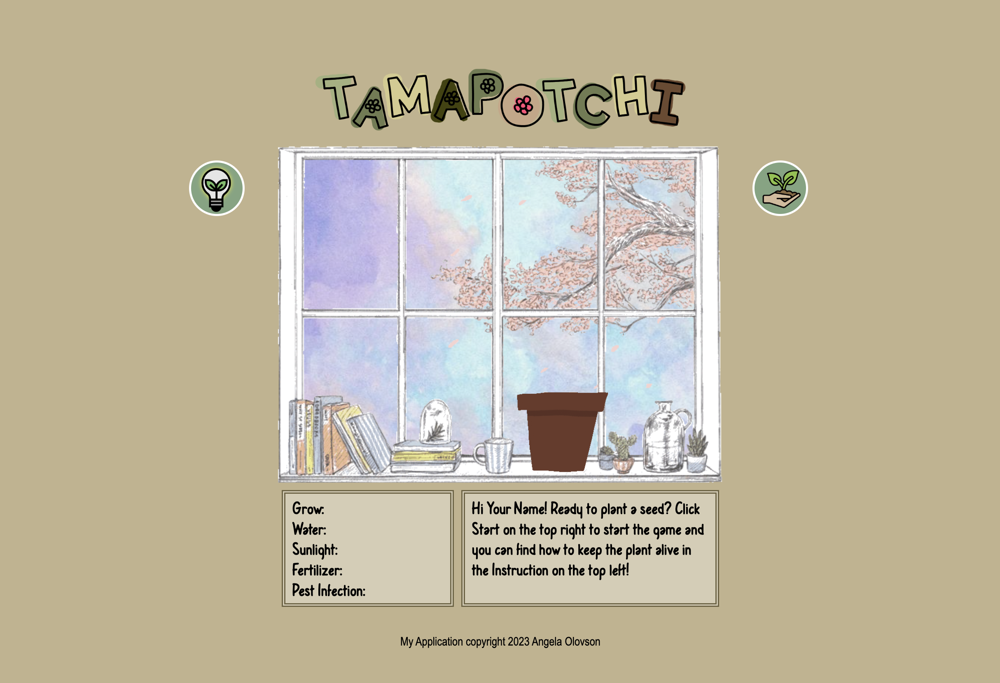

# Tamapotchi - growing plants
Grow a flower from a pot. Keep it growing until level 10 to bloom by watering properly, making sure it has enough sunlight, keeping bugs away, and feeding it plant food sometimes. Any overdo will keep the plant.

## Wireframe

## Steps
1. Type in your name.
2. Click Start(top right icon) to start the game and give starting data.
   - Starting data
     - GROW : 0 (increasing over the time)
     - WATER : 7 (decreasing over the time)
     - SUNLIGHT : 7 (decreasing over the time) 
     - FERTILIZER : 6 (decreasing over the time)
     - PESTICIDE : 0 (increasing over the time)
3. Find the instruction on the top left icon
4. Follow the plant’s needs from the message box and keep it alive until the grow data increases from 0 to 10.
5. Click on restart button to play again no matter win or loss. 

## Rules
Best to keep data in the ranges below:
- 3 <= Water <= 8
- 5 <= Sunlight <= 10
- 3 <= Fertilizer <= 6
- 0 <= Pesticide <= 4

Click on buttons to increase/decrease data:
- Water +2
- Sunlight +4
- Fertilizer +3
- Pesticide -3

The plant will give an alert message if data is not enough or too much: 
- Water <= 3, Water meee!
- Water >= 9, Too much water!!!
- Sunlight < 5, Need a sunbath :)
- Fertilizer <= 2, Want some plant food!
- Fertilizer >= 7, Too much plant food!
- Pesticide >= 5, These bugs are killing me!

You will lost the game if following happens:
- Water = 0 or Water>=10 
- Sunlight = 0
- Fertilizer = 0 or Fertilizer >= 10
- Pesticide < -2 or Pesticide = 10
(Too much or not enough will kill the plant)

Keep it alive until Grow = 10, get blooms and win the game!

## MVP GOALS
* As a player, I want to input my name.
* As a player, I want to click "start" to start the game.
* As a player, I want to see the data from the plant and the instruction.
* As a player, I want to see messages from the plant when it needs to be taken care.
* As a player, I want to click buttons to increase/decease the data to meet the plant's needs.
* As a player, I want to play gifs every time when I click the buttons. 
* As a player, I will kill the plant(lose the game) by not following plant's needs and over-clicking the buttons.
* As a player, I can see my flower bloomed when I win the game.

## Stretch GOALS
* As a player, I would like to click the start button then the rest of the buttons pop up.
* As a player, I would like to play a plant-seeds gif after I click the start button and before the staring data pops up.
* As a player, I would like to play a blooming gif when the grow data is 10.
* As a player, I would like to have the function buttons removed after the blooming gif is played.
* As a player, I would like to the cut button showing and enable to click on it.
* As a player, I would like to have a cut-flower gif playing after I click on the cut button.
* As a player, I would like to have a restart button after the above and after I lose the game.
* As a player, I would like to have the random selection for the blooming flower (3 random options).
